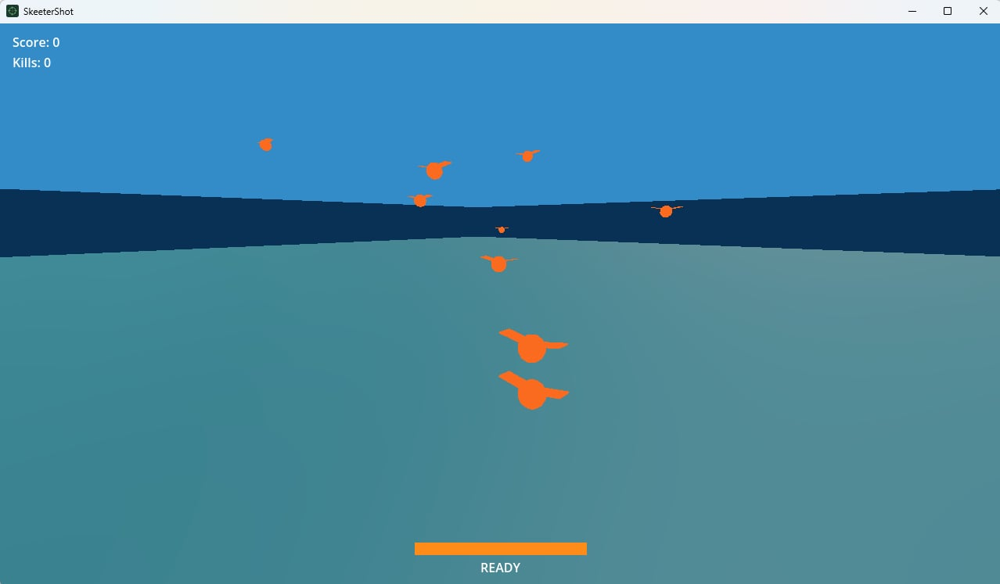
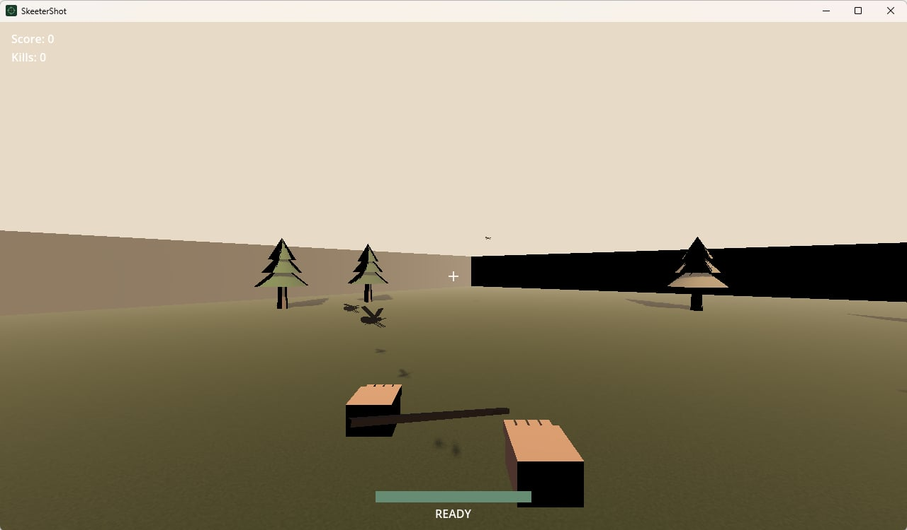

從 2025 年中，我就開始大量使用 AI 工具輔助我編寫程式。而後的過去一年間，AI 輔助工具推陳出新。現在，我的工作流程裡面已經涵蓋大量自動化。在思考的時間逐步擴張的同時，我也開始萌生做 Side Project 的念頭。過去，執行一個 Side Project 對我來說是一件自由時間使用上 CP 值相對很低的選擇，但在最近，我開始有了不同的想法。

## 構想

幾個月前，我曾經短暫的用 GitHub Copilot 來執行了一個非常小的專案，代號叫 Morgen，主要是用來自動產生德文學習的內容，並且產生會自動上傳到各大平台的教學 Podcast。在美商划水多年以後，對於外界用的工具早已生疏，而由人工智慧領導的這個小專案，帶著我把幾個自動化專案的主要元件都摸過一遍，也讓我降低了心中原先預期 Side Project 會有的「高門檻」。

門檻一旦放低，人就敢勇敢作夢。我的構想是要打造一個全自動化工作的公司，該公司會自動的向我吸收各種創意，並且自動化的實踐。從設計、發想，到實作、測試、發布，以及最後的收集回饋、資料分析，這一整套的流水線都由 AI 自動完成。而創辦人（我）需要做的是大量的撰寫文件、審核文件、向員工授權，以及掏出我的信用卡勇敢的刷下去。

## 架構

公司呈現一個扁平架構。由創辦人（我）直接管理兩個部門：Orca 與 Dolphin。Orca 是類似 CEO 的職位，其擁有除了創辦人以外的最高權限，可以授權各個部門執行業務，並且可以簽核各個部門「Escalate」的緊急事件。並且，Orca 是唯一一個以 Daemon 形式隨時在伺服器上監聽最新狀況的部門。Dolphin 擁有幾乎是全公司最小的權限，其只能以「唯讀」的形式處理大多數的資訊。但是 Dolphin 有一個很特別的權限，叫 minority-report。他可以繞過 Orca，從一個隱密的管道把特殊情況呈報給我。我目前並沒有收到任何的通報，希望我的員工們不要吵架。

除了這兩個部門之外，我還有負責公司基礎設施的 Elephant、負責產品的 Leopard、負責文件的 Tortoise …等。這邊就不一一介紹了。所有的部門都只對 Orca 負責，而當交辦的業務無法完成時，他們會利用 GitHub Issues 向公司報告情況，而負責監聽的程式會將監聽到的新 Issues 全部送回 Orca 手上，最後再由 Orca 依照當下情況決定自己是否要動用自己的權限來協助該部門完成這個決定。驚人的是，在過去幾天的工作裡面，我已經看到 Orca 有幾次提高自己的權限來主動完成工作，也有婉拒該部門請求的情況。

## 全自動化

在這個構想裡面，有很多會讓人懷疑的點，比如（可能是最重要的）產品品質。但個人認為，以現在市面上能夠低價訂閱的模型來說，都已經強大到可以完美處理各種「單次」任務了。因此，這些 AI 工具能否有效處理大型專案，最重要的其實是以下幾點：

- 拆解問題
- 訓練迴路
- 全自動化
- 分權制衡

其中，有效拆解問題會將問題拆解至 AI 能夠「單次」完美解決的問題大小。當多個「單次」問題疊加在一起的時候，就會導致解法偏離問題主軸，這時候透過一個不相干的客觀 AI 來評估，並且形成類似古典機器學習中「Feedback」的回饋機制以實踐訓練迴路，再加上做到完美自動化的話，就可以把人類無法專注在工作上的時間塞滿，大幅提升效率。

值得一提的是，這裡提到的分權制衡有點類似公司的構想。這個想法是從生成式對抗網路的概念發想出來的。透過限制每個 Agent 能夠控制的權力以及它在整個專案裡面的能見度，並且賦予不同 Agent 其各自的目標，讓不同 Agent 因為目標不同互相牽制，進一步達成公司的整體目標，是這個想法的核心概念。仔細想一想，這其實也是這個社會的縮影。

> Z00 Studio 已經全自動化了嗎？

是的，只花了我三天。

## 部落格

我打算不規律的在這裡將我的想法公開。可能會包含一些公司運作的內容或是對 AI 工具使用的覺察。希望我能養成保持寫作的習慣。

